# class07
Edward Vo (A16215241)

# Clustering

We will start today’s lab with clustering methods, in particular
so-called K-means. The main function for this in R is `kmeans()`

Let’s try it on some made up data where we know what the answer should
be.

``` r
x<-rnorm(60, mean=3)
hist(x)
```

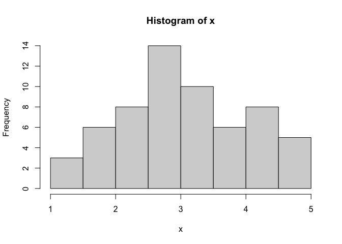

60 points

``` r
tmp <- c(rnorm(30, mean=3), rnorm(30, -3))
x <- cbind(x=tmp, y=rev(tmp))
head(x)
```

                x         y
    [1,] 2.096417 -2.777651
    [2,] 3.354765 -1.980679
    [3,] 3.788908 -3.429293
    [4,] 2.506868 -3.029133
    [5,] 3.359137 -1.050475
    [6,] 2.638980 -2.467509

We can pass this to the base R `plot()` function for a quick plot

``` r
plot(x)
```

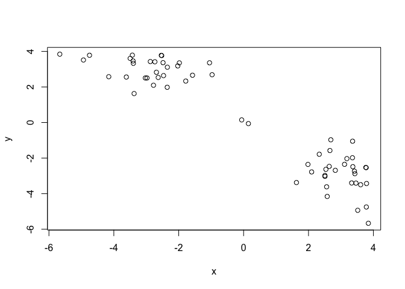

``` r
k <- kmeans(x, centers=2, nstart=20)
k
```

    K-means clustering with 2 clusters of sizes 30, 30

    Cluster means:
              x         y
    1  2.926027 -2.803639
    2 -2.803639  2.926027

    Clustering vector:
     [1] 1 1 1 1 1 1 1 1 2 1 1 1 1 1 1 1 1 1 1 1 1 1 1 1 1 1 1 1 1 1 2 2 2 2 2 2 2 2
    [39] 2 2 2 2 2 2 2 2 2 2 2 2 2 1 2 2 2 2 2 2 2 2

    Within cluster sum of squares by cluster:
    [1] 58.11699 58.11699
     (between_SS / total_SS =  89.4 %)

    Available components:

    [1] "cluster"      "centers"      "totss"        "withinss"     "tot.withinss"
    [6] "betweenss"    "size"         "iter"         "ifault"      

> Q1. How many points are in each cluster?

``` r
k$size
```

    [1] 30 30

> Q2. Cluster membership?

``` r
k$cluster
```

     [1] 1 1 1 1 1 1 1 1 2 1 1 1 1 1 1 1 1 1 1 1 1 1 1 1 1 1 1 1 1 1 2 2 2 2 2 2 2 2
    [39] 2 2 2 2 2 2 2 2 2 2 2 2 2 1 2 2 2 2 2 2 2 2

> Q3. Cluster centers?

``` r
k$centers
```

              x         y
    1  2.926027 -2.803639
    2 -2.803639  2.926027

> Q4. Plot my clustering results

``` r
plot(x, col=k$cluster, pch=16)
```

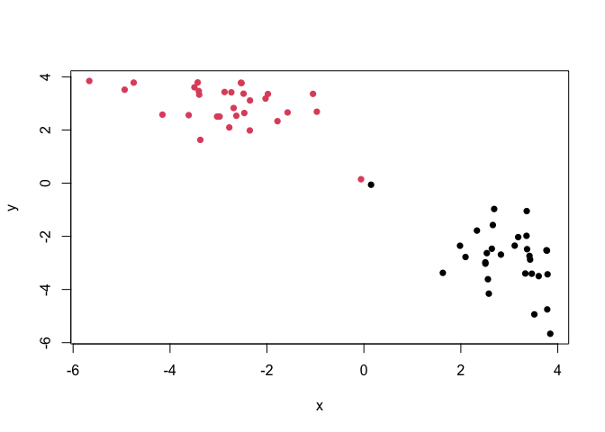

> Q5. Cluster the data again into 4 groups and plot the results

``` r
k4 <- kmeans(x, centers=4, nstart=20)
plot(x, col=k4$cluster, pch=16)
```

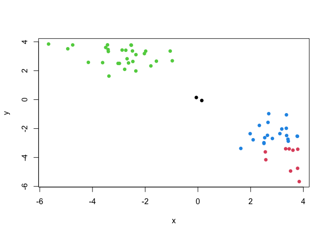

K-means is very popular mostly because it is fast and relatively
straightforward to run and understand. It has a big limitation in that
you need to tell it how many groups(k, or centers) you want.

# Hierarchical clustering

The main function in base R is called `hclust()`. You have to pass it in
a “distance matrix” not just your input data.

You can generate a distance matrix with the `dist()` function.

``` r
hc <- hclust(dist(x))
hc
```


    Call:
    hclust(d = dist(x))

    Cluster method   : complete 
    Distance         : euclidean 
    Number of objects: 60 

``` r
plot(hc)
```

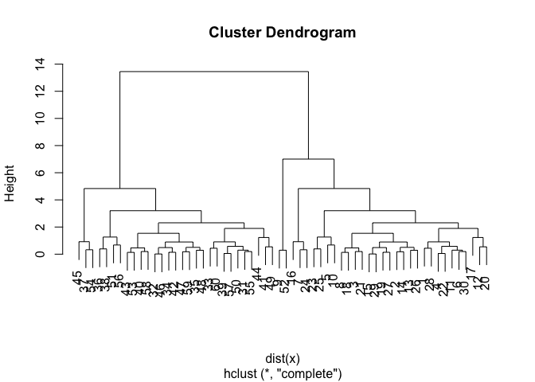

To find clusters (cluster membership vector) from a `hclust()` result we
can “cut” the tree at a certain height that we like.

``` r
plot(hc)
abline(h=8, col="red")
```

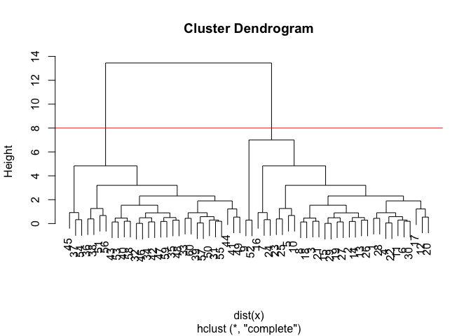

``` r
grps <- cutree(hc, h=8)
```

``` r
table(grps)
```

    grps
     1  2 
    31 29 

> Q6. Plot out hclust results

``` r
plot(x, col=grps)
```

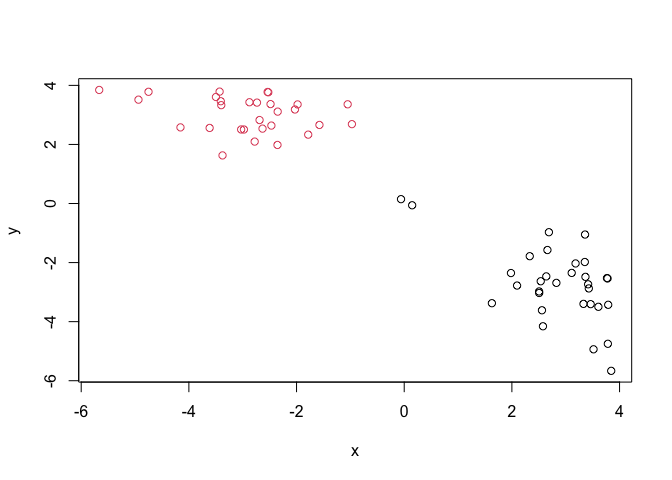

# Principal Component Analysis

## PCA of UK food data

``` r
url <- "https://tinyurl.com/UK-foods"
x <- read.csv(url)
```

# Question 1

``` r
dim(x)
```

    [1] 17  5

``` r
head(x)
```

                   X England Wales Scotland N.Ireland
    1         Cheese     105   103      103        66
    2  Carcass_meat      245   227      242       267
    3    Other_meat      685   803      750       586
    4           Fish     147   160      122        93
    5 Fats_and_oils      193   235      184       209
    6         Sugars     156   175      147       139

Change index

``` r
# Note how the minus indexing works
rownames(x) <- x[,1]
x <- x[,-1]
head(x)
```

                   England Wales Scotland N.Ireland
    Cheese             105   103      103        66
    Carcass_meat       245   227      242       267
    Other_meat         685   803      750       586
    Fish               147   160      122        93
    Fats_and_oils      193   235      184       209
    Sugars             156   175      147       139

``` r
# Alternatively
x <- read.csv(url, row.names=1)
head(x)
```

                   England Wales Scotland N.Ireland
    Cheese             105   103      103        66
    Carcass_meat       245   227      242       267
    Other_meat         685   803      750       586
    Fish               147   160      122        93
    Fats_and_oils      193   235      184       209
    Sugars             156   175      147       139

# Question 2

I prefer second method since code is simpler & assigns directly I would
use first method when the names column is in the first column (no other
data to the left)

Spotting major differences and trends

``` r
barplot(as.matrix(x), beside=T, col=rainbow(nrow(x)))
```


# Question 3

``` r
barplot(as.matrix(x), beside=F, col=rainbow(nrow(x)))
```

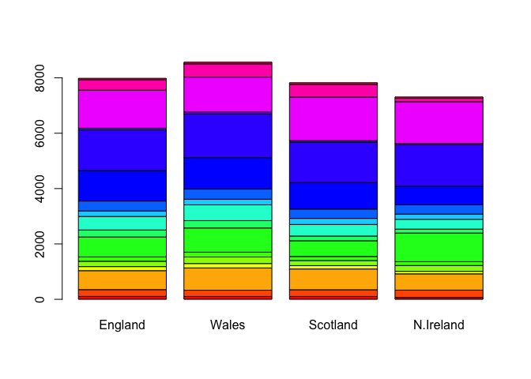

``` r
# Changing to beside=F stacks the individual bars instead of side-by-side
```

# Question 5

``` r
pairs(x, col=rainbow(10), pch=16, cex=2)
```

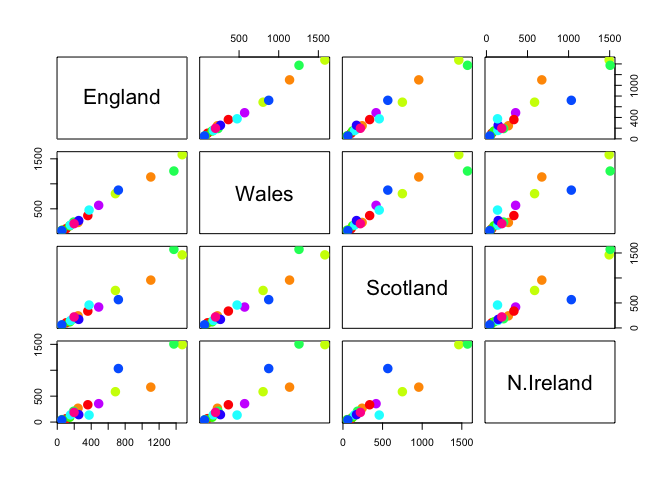

Paired plot matrix generated Above diagonal is flipped from below
diagonal If lie on straight line = same amount

# Question 6

Northern Ireland has a lot of deviation from the straight line

PCA to the rescue PCA can help us make sense of these types of datasets

``` r
# Switch countries and foods with `t()`
head(t(x))
```

              Cheese Carcass_meat  Other_meat  Fish Fats_and_oils  Sugars
    England      105           245         685  147            193    156
    Wales        103           227         803  160            235    175
    Scotland     103           242         750  122            184    147
    N.Ireland     66           267         586   93            209    139
              Fresh_potatoes  Fresh_Veg  Other_Veg  Processed_potatoes 
    England               720        253        488                 198
    Wales                 874        265        570                 203
    Scotland              566        171        418                 220
    N.Ireland            1033        143        355                 187
              Processed_Veg  Fresh_fruit  Cereals  Beverages Soft_drinks 
    England              360         1102     1472        57         1374
    Wales                365         1137     1582        73         1256
    Scotland             337          957     1462        53         1572
    N.Ireland            334          674     1494        47         1506
              Alcoholic_drinks  Confectionery 
    England                 375             54
    Wales                   475             64
    Scotland                458             62
    N.Ireland               135             41

``` r
# Use the prcomp() PCA function 
pca <- prcomp(t(x))
summary(pca)
```

    Importance of components:
                                PC1      PC2      PC3       PC4
    Standard deviation     324.1502 212.7478 73.87622 2.921e-14
    Proportion of Variance   0.6744   0.2905  0.03503 0.000e+00
    Cumulative Proportion    0.6744   0.9650  1.00000 1.000e+00

PC1 captures 67% of all data, very representative

# Question 7

``` r
pca$x
```

                     PC1         PC2        PC3           PC4
    England   -144.99315   -2.532999 105.768945 -9.152022e-15
    Wales     -240.52915 -224.646925 -56.475555  5.560040e-13
    Scotland   -91.86934  286.081786 -44.415495 -6.638419e-13
    N.Ireland  477.39164  -58.901862  -4.877895  1.329771e-13

``` r
# Plot PC1 vs PC2
plot(pca$x[,1], pca$x[,2])
text(pca$x[,1], pca$x[,2], colnames(x))
```

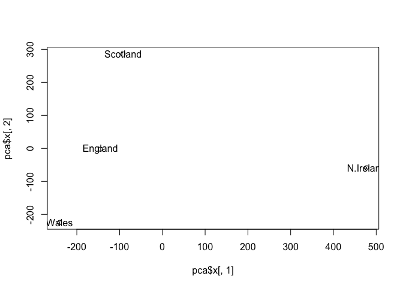

# Question 8

``` r
plot(pca$x[,1], pca$x[,2], col=c("orange", "red", "blue", "darkgreen"), pch=16)
text(pca$x[,1], pca$x[,2], colnames(x))
```

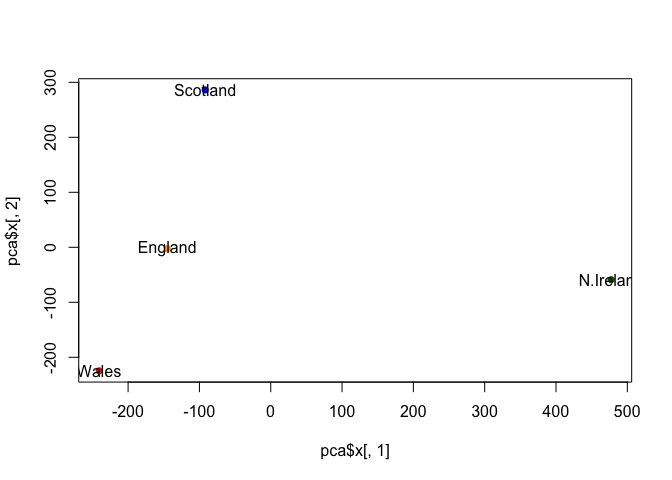

``` r
head(pca$rotation)
```

                            PC1         PC2         PC3         PC4
    Cheese         -0.056955380  0.01601285  0.02394295 -0.40938259
    Carcass_meat    0.047927628  0.01391582  0.06367111  0.72948192
    Other_meat     -0.258916658 -0.01533114 -0.55384854  0.33100113
    Fish           -0.084414983 -0.05075495  0.03906481  0.02237588
    Fats_and_oils  -0.005193623 -0.09538866 -0.12522257  0.03451216
    Sugars         -0.037620983 -0.04302170 -0.03605745  0.02494334

``` r
# Contribution to PCA
```

“Loadings” tell us how much the original variables (in our case, the
foods) contribute to the new variables (the PCA)

``` r
## Lets focus on PC1 as it accounts for > 90% of variance 
par(mar=c(10, 3, 0.35, 0))
barplot( pca$rotation[,1], las=2 )
```


