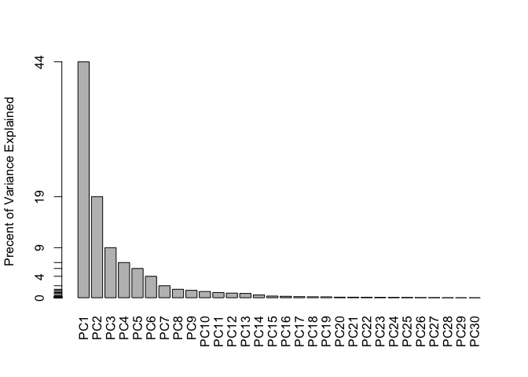
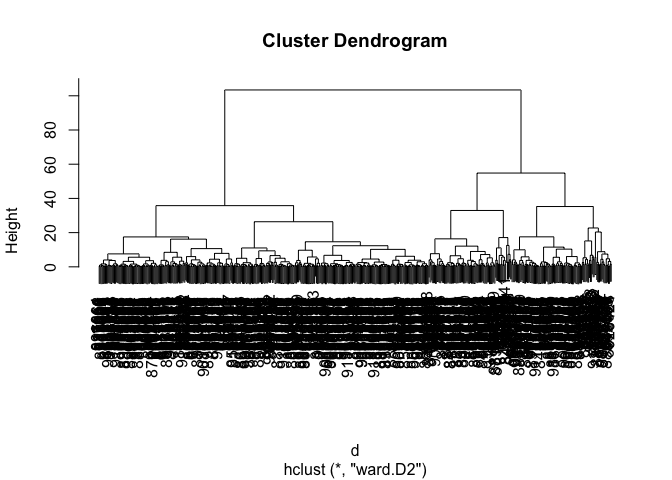

# class08
Edward Vo (A16215241)

## Outline

Today we will apply the machine learning methods we introduced in the
last class on breast cancer biopsy data from fine needle aspiration
(FNA)

Preparing the data

``` r
# Save your input data file into your Project directory
fna.data <- "WisconsinCancer.csv"

# Complete the following code to input the data and store as wisc.df
wisc.df <- read.csv(fna.data, row.names=1)
```

``` r
# We can use -1 here to remove the first column (wisc.df is answer key)
wisc.data <- wisc.df[,-1]
```

``` r
# Create diagnosis vector for later 
diagnosis <- wisc.df$diagnosis
```

## Exploratory data analaysis

# Question 1

``` r
dim(wisc.data)
```

    [1] 569  30

569 observations

# Question 2

``` r
table(diagnosis)
```

    diagnosis
      B   M 
    357 212 

212 are malignant

# Question 3

``` r
x<- colnames(wisc.df)
length(grep("_mean", x))
```

    [1] 10

10 variables are suffixed with “\_mean”

## PCA

``` r
# Check column means and standard deviations
colMeans(wisc.data)
```

                radius_mean            texture_mean          perimeter_mean 
               1.412729e+01            1.928965e+01            9.196903e+01 
                  area_mean         smoothness_mean        compactness_mean 
               6.548891e+02            9.636028e-02            1.043410e-01 
             concavity_mean     concave.points_mean           symmetry_mean 
               8.879932e-02            4.891915e-02            1.811619e-01 
     fractal_dimension_mean               radius_se              texture_se 
               6.279761e-02            4.051721e-01            1.216853e+00 
               perimeter_se                 area_se           smoothness_se 
               2.866059e+00            4.033708e+01            7.040979e-03 
             compactness_se            concavity_se       concave.points_se 
               2.547814e-02            3.189372e-02            1.179614e-02 
                symmetry_se    fractal_dimension_se            radius_worst 
               2.054230e-02            3.794904e-03            1.626919e+01 
              texture_worst         perimeter_worst              area_worst 
               2.567722e+01            1.072612e+02            8.805831e+02 
           smoothness_worst       compactness_worst         concavity_worst 
               1.323686e-01            2.542650e-01            2.721885e-01 
       concave.points_worst          symmetry_worst fractal_dimension_worst 
               1.146062e-01            2.900756e-01            8.394582e-02 

``` r
apply(wisc.data,2,sd)
```

                radius_mean            texture_mean          perimeter_mean 
               3.524049e+00            4.301036e+00            2.429898e+01 
                  area_mean         smoothness_mean        compactness_mean 
               3.519141e+02            1.406413e-02            5.281276e-02 
             concavity_mean     concave.points_mean           symmetry_mean 
               7.971981e-02            3.880284e-02            2.741428e-02 
     fractal_dimension_mean               radius_se              texture_se 
               7.060363e-03            2.773127e-01            5.516484e-01 
               perimeter_se                 area_se           smoothness_se 
               2.021855e+00            4.549101e+01            3.002518e-03 
             compactness_se            concavity_se       concave.points_se 
               1.790818e-02            3.018606e-02            6.170285e-03 
                symmetry_se    fractal_dimension_se            radius_worst 
               8.266372e-03            2.646071e-03            4.833242e+00 
              texture_worst         perimeter_worst              area_worst 
               6.146258e+00            3.360254e+01            5.693570e+02 
           smoothness_worst       compactness_worst         concavity_worst 
               2.283243e-02            1.573365e-01            2.086243e-01 
       concave.points_worst          symmetry_worst fractal_dimension_worst 
               6.573234e-02            6.186747e-02            1.806127e-02 

``` r
# Perform PCA on wisc.data by completing the following code
wisc.pr <- prcomp(wisc.data, scale=TRUE)

# Need to scale since some columns are measured with different units and therefore have different means & variances
```

``` r
# Look at summary of results
summary(wisc.pr)
```

    Importance of components:
                              PC1    PC2     PC3     PC4     PC5     PC6     PC7
    Standard deviation     3.6444 2.3857 1.67867 1.40735 1.28403 1.09880 0.82172
    Proportion of Variance 0.4427 0.1897 0.09393 0.06602 0.05496 0.04025 0.02251
    Cumulative Proportion  0.4427 0.6324 0.72636 0.79239 0.84734 0.88759 0.91010
                               PC8    PC9    PC10   PC11    PC12    PC13    PC14
    Standard deviation     0.69037 0.6457 0.59219 0.5421 0.51104 0.49128 0.39624
    Proportion of Variance 0.01589 0.0139 0.01169 0.0098 0.00871 0.00805 0.00523
    Cumulative Proportion  0.92598 0.9399 0.95157 0.9614 0.97007 0.97812 0.98335
                              PC15    PC16    PC17    PC18    PC19    PC20   PC21
    Standard deviation     0.30681 0.28260 0.24372 0.22939 0.22244 0.17652 0.1731
    Proportion of Variance 0.00314 0.00266 0.00198 0.00175 0.00165 0.00104 0.0010
    Cumulative Proportion  0.98649 0.98915 0.99113 0.99288 0.99453 0.99557 0.9966
                              PC22    PC23   PC24    PC25    PC26    PC27    PC28
    Standard deviation     0.16565 0.15602 0.1344 0.12442 0.09043 0.08307 0.03987
    Proportion of Variance 0.00091 0.00081 0.0006 0.00052 0.00027 0.00023 0.00005
    Cumulative Proportion  0.99749 0.99830 0.9989 0.99942 0.99969 0.99992 0.99997
                              PC29    PC30
    Standard deviation     0.02736 0.01153
    Proportion of Variance 0.00002 0.00000
    Cumulative Proportion  1.00000 1.00000

# Question 4

44.3% of variance is captured by PC1

# Question 5

3 PCs are required to describe at least 70% of data

# Question 6

7 PCs are required to describe at least 90% of data

# Question 7

``` r
biplot(wisc.pr)
```


Very messy plot & too many overlaps

``` r
# Scatter plot observations by components 1 and 2

plot(x=wisc.pr$x[,1], y=wisc.pr$x[,2], col=as.factor(diagnosis), xlab = "PC1", ylab = "PC2")
```


# Question 8

``` r
# Repeat for components 1 and 3
plot(wisc.pr$x[,1], wisc.pr$x[,3], col = as.factor(diagnosis), xlab = "PC1", ylab = "PC3")
```


There is more overlap in graph of PC3:1 than PC2:1 Black = benign Red =
malignant

Making ggplot

``` r
# Create a data.frame for ggplot
df <- as.data.frame(wisc.pr$x)
df$diagnosis <- diagnosis

# Load the ggplot2 package
library(ggplot2)

# Make a scatter plot colored by diagnosis
ggplot(df) + aes(PC1, PC2, col=diagnosis) + geom_point()
```


## Variance explained

``` r
# Calculate variance of each component
pr.var <- wisc.pr$sdev^2
head(pr.var)
```

    [1] 13.281608  5.691355  2.817949  1.980640  1.648731  1.207357

``` r
# Variance explained by each principal component: pve
pve <- wisc.pr$sdev^2 / sum(wisc.pr$sdev^2)

# Plot variance explained for each principal component
plot(pve, xlab = "Principal Component", 
     ylab = "Proportion of Variance Explained", 
     ylim = c(0, 1), type = "o")
```


``` r
# Alternative scree plot of the same data, note data driven y-axis
barplot(pve, ylab = "Precent of Variance Explained",
     names.arg=paste0("PC",1:length(pve)), las=2, axes = FALSE)
axis(2, at=pve, labels=round(pve,2)*100 )
```



``` r
## ggplot based graph
# install.packages("factoextra")
library(factoextra)
```

    Welcome! Want to learn more? See two factoextra-related books at https://goo.gl/ve3WBa

``` r
fviz_eig(wisc.pr, addlabels = TRUE)
```


## Communicating PCA results

# Question 9

``` r
wisc.pr$rotation[,1]
```

                radius_mean            texture_mean          perimeter_mean 
                -0.21890244             -0.10372458             -0.22753729 
                  area_mean         smoothness_mean        compactness_mean 
                -0.22099499             -0.14258969             -0.23928535 
             concavity_mean     concave.points_mean           symmetry_mean 
                -0.25840048             -0.26085376             -0.13816696 
     fractal_dimension_mean               radius_se              texture_se 
                -0.06436335             -0.20597878             -0.01742803 
               perimeter_se                 area_se           smoothness_se 
                -0.21132592             -0.20286964             -0.01453145 
             compactness_se            concavity_se       concave.points_se 
                -0.17039345             -0.15358979             -0.18341740 
                symmetry_se    fractal_dimension_se            radius_worst 
                -0.04249842             -0.10256832             -0.22799663 
              texture_worst         perimeter_worst              area_worst 
                -0.10446933             -0.23663968             -0.22487053 
           smoothness_worst       compactness_worst         concavity_worst 
                -0.12795256             -0.21009588             -0.22876753 
       concave.points_worst          symmetry_worst fractal_dimension_worst 
                -0.25088597             -0.12290456             -0.13178394 

Concave points mean: -0.26085376

# Question 10

5 PCs are required to describe at least 80% of data

## Hierarchical clustering

``` r
# Scale the wisc.data data using the "scale()" function
data.scaled <- scale(wisc.data)

# Calculate Euclidean distance
data.dist <- dist(data.scaled)

# Hierarchical clustering with complete linkage
wisc.hclust <- hclust(data.dist)
```

# Question 11

``` r
plot(wisc.hclust)
abline(h = 19, col="red", lty=2)
```


Height = 19

## Selecting number of clusters

``` r
wisc.hclust.clusters <- cutree(wisc.hclust, k=4)

# Compare membership to diagnosis
table(wisc.hclust.clusters, diagnosis)
```

                        diagnosis
    wisc.hclust.clusters   B   M
                       1  12 165
                       2   2   5
                       3 343  40
                       4   0   2

# Question 12

``` r
# Any better clustering?
new <- cutree(wisc.hclust, k=2)
table(new, diagnosis)
```

       diagnosis
    new   B   M
      1 357 210
      2   0   2

Less messy

## Using different methods

``` r
complete <- hclust(data.dist, method="complete")
plot(complete)
```


``` r
single <- hclust(data.dist, method="single")
plot(single)
```


``` r
average <- hclust(data.dist, method="average")
plot(average)
```


``` r
ward.d2 <- hclust(data.dist, method="ward.D2")
plot(ward.d2)
```


# Question 13

Favorite is single because since it does a 1-by-1 approach, it gives
slanted clusters (even though it’s hard to draw associations and have a
clear abline)

## K-means clustering

``` r
wisc.km <- kmeans(scale(wisc.data), centers = 2, nstart = 20)
table(wisc.km$cluster, diagnosis)
```

       diagnosis
          B   M
      1  14 175
      2 343  37

# Question 14

It does a better job in separating B to M by proportion of the cluster

## Combining methods

Use PCA results instead of original data

``` r
d <- dist(wisc.pr$x[,1:3])
wisc.pr.hclust <- hclust(d, method = "ward.D2")
plot (wisc.pr.hclust)
```



Generate 2 cluster groups from this hclust object

``` r
grps <- cutree(wisc.pr.hclust, k=2)
table(grps)
```

    grps
      1   2 
    203 366 

``` r
plot(wisc.pr$x[,1], wisc.pr$x[,2], col=grps)
```


``` r
table(diagnosis)
```

    diagnosis
      B   M 
    357 212 

``` r
table(diagnosis, grps)
```

             grps
    diagnosis   1   2
            B  24 333
            M 179  33

B1 false positive M2 false negative

# Question 15

``` r
table(grps, diagnosis)
```

        diagnosis
    grps   B   M
       1  24 179
       2 333  33

Good sensitivity
